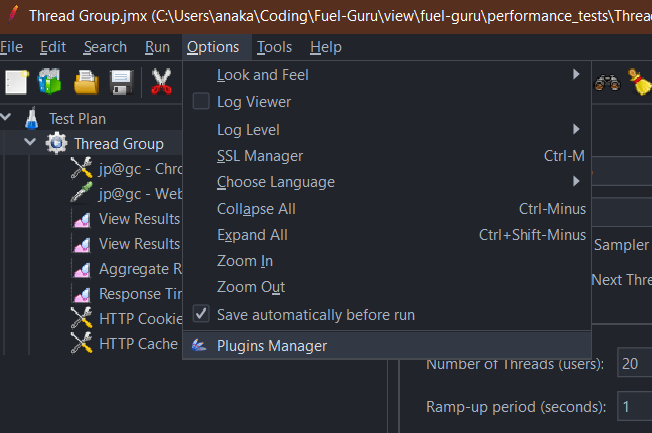
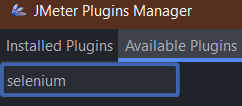
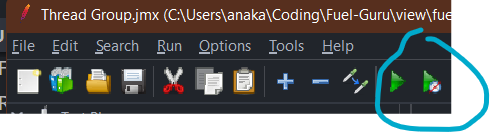

# Install JMeter

1. Install [Selenium web drivers](https://www.selenium.dev/documentation/webdriver/getting_started/install_drivers/).
2. Ensure you have Java 8+ installed.
3. Download and unzip [JMeter](https://jmeter.apache.org/download_jmeter.cgi)
4. [Install JMeter](https://jmeter.apache.org/usermanual/get-started.html#install). Pretty much unzip and run bin/jmeter.bat.
5. [Install JMeter plugins manager](https://jmeter-plugins.org/wiki/PluginsManager/)
6. Start or restart JMeter.
7. open the plugin manager 

8. install selenium plugin

9. open Thread Group.jmx from this folder in JMeter

10. run thread group

11. check output folder for results/ check view results tree and table in JMeter

12. might have to add this plugin to do PT12? [PerfMon](https://jmeter-plugins.org/wiki/PerfMon)